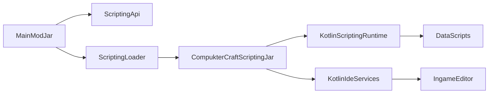

# Точный план для Kotlin Scripting + IDE

## Цель

Сделать в `Compukter-Craft` основу для полноценной поддержки `.kts`-скриптов и IDE-функций, не загружая Kotlin compiler stack в основной classpath Forge-мода.

## Архитектура

## Изменения по файлам

### 1. Очистить корневой модуль от прямой привязки к Kotlin scripting runtime

- Обновить `[/home/lazyhat/IdeaProjects/Compukter-Craft/build.gradle.kts](/home/lazyhat/IdeaProjects/Compukter-Craft/build.gradle.kts)`.
- Убрать из root-модуля прямые `implementation`/`forgeRuntimeLibrary` для:
  - `kotlin-scripting-common`
  - `kotlin-scripting-dependencies`
  - `kotlin-scripting-jvm`
  - `kotlin-scripting-jvm-host`
- Не добавлять сюда `kotlin-compiler-embeddable`.
- Оставить root-модуль только с обычными mod/runtime зависимостями Forge/Architectury и API-классами scripting layer.

### 2. Создать стабильный scripting API в основном моде

- Добавить новый пакет в основном коде: `[/home/lazyhat/IdeaProjects/Compukter-Craft/src/main/kotlin/ru/lazyhat/compuktercraft/scripting/api/](/home/lazyhat/IdeaProjects/Compukter-Craft/src/main/kotlin/ru/lazyhat/compuktercraft/scripting/api/)`.
- Создать интерфейсы и DTO:
  - `ScriptingEnvironmentInitializer`
  - `ScriptingEnvironment`
  - `ScriptCompiler`
  - `ScriptIdeService`
  - `CompiledScript`
  - `ScriptDefinitionDescriptor`
  - `Diagnostic`
  - `CompletionItem`
  - `HoverInfo`
  - `DefinitionTarget`
  - `HighlightToken`
- Требование к API:
  - без импортов `org.jetbrains.kotlin.*` compiler internals;
  - только простые сериализуемые/обычные DTO и интерфейсы;
  - main mod знает только эту границу.

### 3. Добавить runtime bridge и loader в основном моде

- Добавить пакет `[/home/lazyhat/IdeaProjects/Compukter-Craft/src/main/kotlin/ru/lazyhat/compuktercraft/scripting/runtime/](/home/lazyhat/IdeaProjects/Compukter-Craft/src/main/kotlin/ru/lazyhat/compuktercraft/scripting/runtime/)`.
- Создать классы:
  - `ScriptingJarLoader`
  - `ScriptingEnvironmentHolder`
  - `ScriptingPaths`
- Функции loader’а:
  - искать `CompukterCraftScripting.jar` в папке `compuktercraft/` рядом с рабочей директорией мода;
  - открывать его через `URLClassLoader` с parent = classloader основного мода;
  - рефлексивно загружать entrypoint `ru.lazyhat.compuktercraft.scripting.impl.ScriptingEnvironmentInitializerImpl`;
  - вызывать `initialize(...)` и получать реализацию `ScriptingEnvironment`.
- Добавить безопасный fallback: если jar не найден или не загрузился, mod продолжает стартовать, а scripting/IDE остаются отключёнными.

### 4. Переподключить init основного мода на loader

- Обновить `[/home/lazyhat/IdeaProjects/Compukter-Craft/src/main/kotlin/ru/lazyhat/compuktercraft/CompukterCraftMod.kt](/home/lazyhat/IdeaProjects/Compukter-Craft/src/main/kotlin/ru/lazyhat/compuktercraft/CompukterCraftMod.kt)`.
- Убрать прямой вызов `BasicJvmScriptingHost()` из `checkScriptingDependency()`.
- Заменить его на инициализацию loader’а и логирование статуса scripting environment.
- На этом этапе `CompukterCraftMod` должен только:
  - проверить наличие scripting jar;
  - инициализировать runtime bridge;
  - сохранить ссылку на loaded/unloaded state.

### 5. Подготовить `:scripting` как отдельный fat jar

- Обновить `[/home/lazyhat/IdeaProjects/Compukter-Craft/scripting/build.gradle.kts](/home/lazyhat/IdeaProjects/Compukter-Craft/scripting/build.gradle.kts)`.
- Подключить плагины:
  - `kotlin-convention`
  - `com.gradleup.shadow`
- Настроить отдельный artifact `CompukterCraftScripting.jar`.
- В зависимости `:scripting` добавить:
  - `kotlin-stdlib`
  - `kotlin-scripting-common`
  - `kotlin-scripting-dependencies`
  - `kotlin-scripting-jvm`
  - `kotlin-scripting-jvm-host`
  - `kotlin-compiler-embeddable`
- Для IDE-слоя добавить Kotlin analysis/compiler-for-IDE артефакты и JetBrains platform jars отдельным блоком.
- Подключить API-контракты из основного мода без встраивания всего root jar в final fat jar.
- Shadow-конфигурация должна исключать дублируемые части root-мода и собирать только scripting implementation + compiler stack.

### 6. Зафиксировать версии и каталоги зависимостей

- Обновить `[/home/lazyhat/IdeaProjects/Compukter-Craft/config/libs.versions.toml](/home/lazyhat/IdeaProjects/Compukter-Craft/config/libs.versions.toml)`.
- Добавить записи для минимального scripting/IDE набора:
  - `analysis-api-k2-for-ide`
  - `analysis-api-for-ide`
  - `analysis-api-standalone-for-ide`
  - `kotlin-compiler-common-for-ide`
  - `kotlin-compiler-cli-for-ide`
  - `kotlin-compiler-fir-for-ide`
  - дополнительные IntelliJ platform libs по мере необходимости.
- Держать версии Kotlin, scripting и compiler согласованными через один version catalog.

### 7. Реализовать entrypoint и runtime environment внутри `:scripting`

- Добавить пакет `[/home/lazyhat/IdeaProjects/Compukter-Craft/scripting/src/main/kotlin/ru/lazyhat/compuktercraft/scripting/impl/](/home/lazyhat/IdeaProjects/Compukter-Craft/scripting/src/main/kotlin/ru/lazyhat/compuktercraft/scripting/impl/)`.
- Создать классы:
  - `ScriptingEnvironmentInitializerImpl`
  - `ScriptingEnvironmentImpl`
  - `ScriptCompilerImpl`
  - `CompiledScriptImpl`
- Минимальный runtime-функционал первой реализации:
  - загрузка script definitions;
  - компиляция `String` и `File` в compiled script;
  - выполнение compiled script;
  - конвертация Kotlin diagnostics в shared `Diagnostic` DTO.

### 8. Поддержать определения скриптов и загрузку `.kts`

- Использовать существующий ресурсный каталог `[/home/lazyhat/IdeaProjects/Compukter-Craft/src/main/resources/data/compuktercraft/kotlin/](/home/lazyhat/IdeaProjects/Compukter-Craft/src/main/resources/data/compuktercraft/kotlin/)`.
- Добавить в `:scripting` registry описаний скриптов:
  - расширение файла;
  - базовый класс;
  - default imports;
  - host/evaluation/compilation configuration.
- Первая поддержка может стартовать с одного стандартного `.kts`-типа.

### 9. Поднять IDE service на той же API-границе

- В `:scripting` добавить реализацию `ScriptIdeService`.
- Реализовать поэтапно, но в одной архитектуре:
  - diagnostics;
  - syntax/token highlighting;
  - completion;
  - hover;
  - go-to-definition.
- Все ответы наружу возвращать через shared DTO из API-пакета main-мода.

### 10. Добавить доставку scripting jar в dev/run среду

- В `[/home/lazyhat/IdeaProjects/Compukter-Craft/build.gradle.kts](/home/lazyhat/IdeaProjects/Compukter-Craft/build.gradle.kts)` или отдельной gradle task-конфигурации настроить копирование артефакта `:scripting:shadowJar` в рабочую папку запуска, например `run/compuktercraft/CompukterCraftScripting.jar`.
- Это нужно, чтобы dev `runClient` видел scripting-jar без ручного копирования.
- Аналогично предусмотреть release-процедуру: основной mod jar и scripting jar публикуются/кладутся отдельно.

### 11. Добавить деградацию и диагностику отсутствия scripting jar

- В основном моде предусмотреть:
  - явный лог о статусе scripting environment;
  - метод проверки `isAvailable`;
  - текст ошибок для UI/команд, если jar отсутствует или loader упал.
- Это упростит отладку и позволит игре запускаться даже без scripting-компонента.

## Порядок реализации

1. Очистить root build от прямых scripting runtime зависимостей.
2. Создать API-контракты в основном моде.
3. Реализовать loader и интегрировать его в `CompukterCraftMod`.
4. Поднять `:scripting` как отдельный shadow/fat jar.
5. Реализовать `ScriptingEnvironmentInitializerImpl` и runtime KTS compilation/execution.
6. Подключить dev-копирование jar в run directory.
7. Поверх этого добавить IDE service: diagnostics -> highlighting -> completion -> hover -> definition.

## Критерии готовности

- Основной мод стартует без прямого `BasicJvmScriptingHost()` и без compiler jars в своём runtime classpath.
- `CompukterCraftScripting.jar` собирается отдельной Gradle task.
- В dev-среде jar автоматически попадает в рабочую папку.
- Loader находит jar и успешно инициализирует `ScriptingEnvironment`.
- Простейший `.kts` из `data/compuktercraft/kotlin/` компилируется и выполняется.
- IDE API возвращает хотя бы diagnostics на первой рабочей итерации, затем completion/hover/goto-definition на той же архитектуре.

