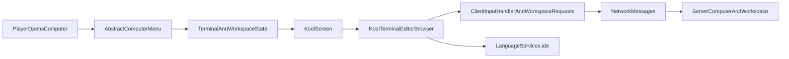

# План миграции GUI на Kool

## Что уже есть

- Текущий экран компьютера зарегистрирован как vanilla screen в [ClientRegistry.kt](/home/lazyhat/IdeaProjects/Compukter-Kraft/mod/src/main/kotlin/ck/mod/ClientRegistry.kt) и открывает [ComputerWorkbenchScreen.kt](/home/lazyhat/IdeaProjects/Compukter-Kraft/mod/src/main/kotlin/ck/mod/gui/ComputerWorkbenchScreen.kt).
- `Kool` уже подключен в [mod/build.gradle.kts](/home/lazyhat/IdeaProjects/Compukter-Kraft/mod/build.gradle.kts), а [KoolScreen.kt](/home/lazyhat/IdeaProjects/Compukter-Kraft/mod/src/main/kotlin/ck/mod/gui/KoolScreen.kt) существует как пустая точка расширения.
- Сетевой и state-слой уже отделены от отрисовки: [AbstractComputerMenu.kt](/home/lazyhat/IdeaProjects/Compukter-Kraft/mod/src/main/kotlin/ck/mod/menu/AbstractComputerMenu.kt), [ClientNetworkContextImpl.kt](/home/lazyhat/IdeaProjects/Compukter-Kraft/mod/src/main/kotlin/ck/mod/network/client/ClientNetworkContextImpl.kt), [ComputerTerminalClientMessage.kt](/home/lazyhat/IdeaProjects/Compukter-Kraft/mod/src/main/kotlin/ck/mod/network/client/ComputerTerminalClientMessage.kt), [ComputerWorkspaceClientMessage.kt](/home/lazyhat/IdeaProjects/Compukter-Kraft/mod/src/main/kotlin/ck/mod/network/client/ComputerWorkspaceClientMessage.kt).

```48:88:/home/lazyhat/IdeaProjects/Compukter-Kraft/mod/build.gradle.kts
plugins {
    idea
    alias(libs.plugins.kotlinConvention)
    alias(libs.plugins.architectury.loom)
    alias(libs.plugins.architectury.plugin)
}

// ...

dependencies {
    // ...
    forgeImplementation(projects.compiler)
    forgeImplementation(libs.kool.core)
    // ...
}

fun <T : ModuleDependency> DependencyHandler.forgeImplementation(dependency: Provider<T>) {
    implementation(dependency) {
        isTransitive = false
    }
    forgeRuntimeLibrary(dependency) {
        isTransitive = false
    }
}
```

```29:35:/home/lazyhat/IdeaProjects/Compukter-Kraft/mod/src/main/kotlin/ck/mod/ClientRegistry.kt
object ClientRegistry {
    fun registerMainThread() {
        try {
            MenuScreens.register(
                ModRegistry.Menus.COMPUTER.get(),
                { container, inventory, title -> ComputerWorkbenchScreen(container, inventory, title) },
```

## Целевая архитектура

Сохраняем существующий `menu + network + runtime` слой и меняем только клиентский presentation layer.




## Шаги реализации

1. Подготовить Kool bootstrap в [KoolScreen.kt](/home/lazyhat/IdeaProjects/Compukter-Kraft/mod/src/main/kotlin/ck/mod/gui/KoolScreen.kt): lifecycle, resize, input forwarding, `render` bridge и безопасное восстановление GL/Minecraft state.
2. Вынести UI-state из [ComputerWorkbenchScreen.kt](/home/lazyhat/IdeaProjects/Compukter-Kraft/mod/src/main/kotlin/ck/mod/gui/ComputerWorkbenchScreen.kt) в отдельный presenter/state-holder, чтобы Kool-компоненты читали те же `terminalData`, `workspaceEntries`, `workspaceDocument`, `LanguageIde` snapshot и действия `save/reboot/requestListing/requestDocument`.
3. Заменить регистрацию в [ClientRegistry.kt](/home/lazyhat/IdeaProjects/Compukter-Kraft/mod/src/main/kotlin/ck/mod/ClientRegistry.kt) с `ComputerWorkbenchScreen` на Kool-backed screen, не ломая открытие через `MenuScreens.register`.
4. Перенести терминал из [TerminalWidget.kt](/home/lazyhat/IdeaProjects/Compukter-Kraft/mod/src/main/kotlin/ck/mod/gui/TerminalWidget.kt) в Kool-компонент: вывод буфера, курсор, selection, keyboard/mouse события, paste, scroll, focus.
5. Перенести IDE-часть из [ComputerWorkbenchScreen.kt](/home/lazyhat/IdeaProjects/Compukter-Kraft/mod/src/main/kotlin/ck/mod/gui/ComputerWorkbenchScreen.kt): режимы `TERMINAL/EDITOR`, файловый браузер, текстовый редактор, completions, hover, go-to-definition, save/refresh/up/reboot.
6. Оставить без существенных изменений menu/network слой: [AbstractComputerMenu.kt](/home/lazyhat/IdeaProjects/Compukter-Kraft/mod/src/main/kotlin/ck/mod/menu/AbstractComputerMenu.kt), [ComputerWorkspaceServerMessage.kt](/home/lazyhat/IdeaProjects/Compukter-Kraft/mod/src/main/kotlin/ck/mod/network/server/ComputerWorkspaceServerMessage.kt), [ClientNetworkContextImpl.kt](/home/lazyhat/IdeaProjects/Compukter-Kraft/mod/src/main/kotlin/ck/mod/network/client/ClientNetworkContextImpl.kt).
7. Удалить или законсервировать legacy-рендер helpers после паритета: [AbstractComputerScreen.kt](/home/lazyhat/IdeaProjects/Compukter-Kraft/mod/src/main/kotlin/ck/mod/gui/AbstractComputerScreen.kt), [ComputerSidebar.kt](/home/lazyhat/IdeaProjects/Compukter-Kraft/mod/src/main/kotlin/ck/mod/gui/ComputerSidebar.kt), [ComputerBorderRenderer.kt](/home/lazyhat/IdeaProjects/Compukter-Kraft/mod/src/main/kotlin/ck/mod/gui/ComputerBorderRenderer.kt), [GuiSprites.kt](/home/lazyhat/IdeaProjects/Compukter-Kraft/mod/src/main/kotlin/ck/mod/gui/GuiSprites.kt).

## Ключевые технические решения

- Не переписывать compiler/analyzer/language/shell: `LanguageServices.ide` уже вызывается из GUI и может быть переиспользован новым Kool presentation layer.
- Не менять wire format сообщений: это снижает риск регрессий в терминале и workspace sync.
- Сначала обеспечить bridge для одного `Screen`, а затем внутри него собрать весь интерфейс Kool; это минимизирует изменения в открытии GUI.
- На раннем этапе проверить, достаточно ли текущего `libs.kool.core`; если для Minecraft/Forge bridge понадобится desktop/LWJGL-variant или дополнительные transitives, зафиксировать это в build-конфигурации до массового рефакторинга.

## Риски и проверки

- В [mod/build.gradle.kts](/home/lazyhat/IdeaProjects/Compukter-Kraft/mod/build.gradle.kts) `forgeImplementation(...)` выставлен `isTransitive = false`; если Kool потребует дополнительные модули, их придется добавить явно.
- Нужно проверить client bootstrap на дублирующую регистрацию из [CompukterKraftMod.kt](/home/lazyhat/IdeaProjects/Compukter-Kraft/mod/src/main/kotlin/ck/mod/CompukterKraftMod.kt) и [ForgeClientHooks.kt](/home/lazyhat/IdeaProjects/Compukter-Kraft/mod/src/main/kotlin/ck/mod/ForgeClientHooks.kt), чтобы при замене screen factory не получить двойной init.
- Самая рискованная часть миграции не IDE-логика, а `input/render/focus/clipboard` bridge между Minecraft `Screen` и Kool.

## Критерий готовности

- Экран компьютера открывается через `MenuScreens` как раньше.
- Терминал полностью работает в Kool: ввод, мышь, paste, scroll, reboot, terminal updates.
- IDE-панель полностью работает в Kool: список файлов, открытие/сохранение документа, completions, hover, definition navigation.
- Существующие server/network/runtime классы остаются основным источником истины для состояния компьютера.

