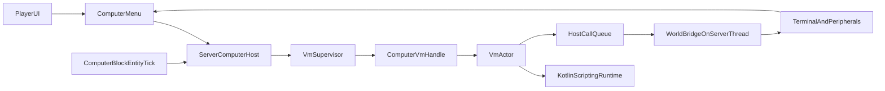

# Kotlin VM Architecture

## Цель

Собрать архитектуру, в которой Kotlin-скрипты исполняются в фоновых VM, но взаимодействуют с Minecraft-миром только через контролируемый host bridge на серверном тике. Это даст модель, близкую к CC:Tweaked, с возможностью квот, профилей компьютеров и будущей IDE.

## Целевая схема

## Архитектурные слои

### 1. Shared scripting runtime

Оставить глобальным только compiler/runtime слой, а не живые VM.

Использовать как основу:

- [scripting-api/src/main/kotlin/ru/lazyhat/compukterkraft/scripting/api/ScriptingServices.kt](/home/lazyhat/IdeaProjects/Compukter-Kraft/scripting-api/src/main/kotlin/ru/lazyhat/compukterkraft/scripting/api/ScriptingServices.kt)
- [scripting/src/main/kotlin/ru/lazyhat/compukterkraft/scripting/impl/ScriptingEnvironmentImpl.kt](/home/lazyhat/IdeaProjects/Compukter-Kraft/scripting/src/main/kotlin/ru/lazyhat/compukterkraft/scripting/impl/ScriptingEnvironmentImpl.kt)
- [mod/src/main/kotlin/ru/lazyhat/compukterkraft/scripting/runtime/ScriptingJarLoader.kt](/home/lazyhat/IdeaProjects/Compukter-Kraft/mod/src/main/kotlin/ru/lazyhat/compukterkraft/scripting/runtime/ScriptingJarLoader.kt)

Роль слоя:

- компиляция и кэш compiled scripts;
- единый `ScriptDefinition` для computer scripts;
- IDE services: diagnostics, completion, hover;
- загрузка boot/ROM scripts.

Важно:

- `ScriptingEnvironmentHolder` должен хранить только shared runtime services;
- per-computer state сюда не помещать.

### 2. Per-computer VM runtime

Добавить отдельный VM-контракт вместо текущего незавершенного [scripting-api/src/main/kotlin/ru/lazyhat/compukterkraft/machine/KotlinScriptingMachine.kt](/home/lazyhat/IdeaProjects/Compukter-Kraft/scripting-api/src/main/kotlin/ru/lazyhat/compukterkraft/machine/KotlinScriptingMachine.kt).

Предлагаемые сущности:

- `ComputerVmHandle`
- `VmSupervisor`
- `VmMailbox`
- `VmState`
- `VmEvent`
- `HostCall`
- `HostResult`
- `ComputerProfile`

Минимальный контракт VM:

- `start(profile, bootProgram)`
- `stop(reason)`
- `enqueueEvent(event)`
- `requestSlice(serverTick)`
- `drainHostCalls()`
- `deliverHostResults(results)`
- `snapshot()` / `restore()` позже

### 3. Mod host layer

Опорные интеграционные точки:

- [mod/src/main/kotlin/ru/lazyhat/compukterkraft/computer/ServerComputer.kt](/home/lazyhat/IdeaProjects/Compukter-Kraft/mod/src/main/kotlin/ru/lazyhat/compukterkraft/computer/ServerComputer.kt)
- [mod/src/main/kotlin/ru/lazyhat/compukterkraft/block/AbstractComputerBlockEntity.kt](/home/lazyhat/IdeaProjects/Compukter-Kraft/mod/src/main/kotlin/ru/lazyhat/compukterkraft/block/AbstractComputerBlockEntity.kt)
- [mod/src/main/kotlin/ru/lazyhat/compukterkraft/computer/ComputerEvents.kt](/home/lazyhat/IdeaProjects/Compukter-Kraft/mod/src/main/kotlin/ru/lazyhat/compukterkraft/computer/ComputerEvents.kt)

Роль слоя:

- `ServerComputer` становится host-объектом для конкретного компьютера;
- `serverTick()` исполняет `HostCall` и синхронизирует состояние;
- `queueEvent()` кладет события в mailbox VM;
- `turnOn/shutdown/reboot` управляют lifecycle VM.

### 4. Capability API для sandbox-модели

Вместо прямого доступа к JVM/Minecraft, скрипт получает только узкий API:

- `terminal`
- `filesystem`
- `events`
- `system`
- `redstone`
- `peripherals`

Это должен быть основной security boundary на первом этапе. Скрипт не должен видеть `Level`, `BlockEntity`, `ServerPlayer` и другие Minecraft объекты напрямую.

## Ключевые решения

- Не выделять отдельный OS thread на каждый компьютер; использовать ограниченный coroutine dispatcher/pool.
- Делать отдельный `VmActor` на компьютер с mailbox.
- Выполнять скрипт с budget slices, чтобы позже поддержать разные классы компьютеров.
- Все обращения к миру оформлять как `HostCall`, которые исполняются обратно на server thread.
- Разделить `boot/ROM scripts` и пользовательские scripts storage.

## Рекомендуемый порядок внедрения

### Этап 1. Стабилизация scripting foundation

1. Зафиксировать один `ComputerScriptDefinition` для VM-скриптов.
2. Прокинуть реальные bindings/context в `execute(properties)` в `ScriptingEnvironmentImpl`.
3. Выровнять пути boot script между:
  - `CompukterKraftMod`
  - `ServerComputer.turnOn()`
  - ресурсами scripting/mod модулей.
4. Пересмотреть `KotlinScriptingMachine` и заменить на законченный VM API.

### Этап 2. Введение VM domain model

Добавить в `scripting-api` или в отдельный runtime API:

- `ComputerProfile`
- `VmState`
- `VmEvent`
- `HostCall` / `HostResult`
- `ComputerVmHandle`

Смысл: стабилизировать контракт до интеграции с GUI и block entity.

### Этап 3. Host/runtime split в mod

В `mod` слое:

- превратить `ServerComputer` в orchestrator;
- добавить `VmSupervisor`, который создает/закрывает VM по `instanceID`;
- реализовать `queueEvent()` через VM mailbox;
- реализовать `serverTick()` как pump для host calls и sync state.

### Этап 4. Cooperative background execution

Поверх фоновой корутины ввести примитивы:

- `yield()`
- `sleep(ticks)`
- `pullEvent(filter?)`
- budget exceeded -> pause until next slice

Это даст CC-like поведение и основу для профилей производительности.

### Этап 5. Profiles и progression

Связать `ComputerFamily` с `ComputerProfile`:

- `cpuBudgetPerTick`
- `maxEventQueue`
- `terminal dimensions`
- `allowedApis`
- будущие ограничения памяти/файлов/периферии

### Этап 6. Основа под IDE

Использовать уже существующий API слой:

- [scripting-api/src/main/kotlin/ru/lazyhat/compukterkraft/scripting/api/ScriptingServices.kt](/home/lazyhat/IdeaProjects/Compukter-Kraft/scripting-api/src/main/kotlin/ru/lazyhat/compukterkraft/scripting/api/ScriptingServices.kt)
- `ScriptIdeService`

Подготовить отдельно от VM:

- файловую модель компьютера;
- document sync packets;
- compile/diagnostics по запросу;
- explicit run/restart deployment в VM.

## Конкретные файлы, которые станут центром изменений

- [scripting-api/src/main/kotlin/ru/lazyhat/compukterkraft/machine/KotlinScriptingMachine.kt](/home/lazyhat/IdeaProjects/Compukter-Kraft/scripting-api/src/main/kotlin/ru/lazyhat/compukterkraft/machine/KotlinScriptingMachine.kt)
- [scripting/src/main/kotlin/ru/lazyhat/compukterkraft/scripting/impl/ScriptingEnvironmentImpl.kt](/home/lazyhat/IdeaProjects/Compukter-Kraft/scripting/src/main/kotlin/ru/lazyhat/compukterkraft/scripting/impl/ScriptingEnvironmentImpl.kt)
- [mod/src/main/kotlin/ru/lazyhat/compukterkraft/computer/ServerComputer.kt](/home/lazyhat/IdeaProjects/Compukter-Kraft/mod/src/main/kotlin/ru/lazyhat/compukterkraft/computer/ServerComputer.kt)
- [mod/src/main/kotlin/ru/lazyhat/compukterkraft/block/AbstractComputerBlockEntity.kt](/home/lazyhat/IdeaProjects/Compukter-Kraft/mod/src/main/kotlin/ru/lazyhat/compukterkraft/block/AbstractComputerBlockEntity.kt)
- [mod/src/main/kotlin/ru/lazyhat/compukterkraft/CompukterKraftMod.kt](/home/lazyhat/IdeaProjects/Compukter-Kraft/mod/src/main/kotlin/ru/lazyhat/compukterkraft/CompukterKraftMod.kt)

## Что не делать на первом этапе

- Не пытаться строить полноценную JVM security sandbox.
- Не давать скриптам прямой доступ к Minecraft/Forge API.
- Не смешивать IDE transport и runtime lifecycle.
- Не компилировать скрипт на каждый тик.
- Не хранить живую VM как часть одного только block entity без supervisor layer.

