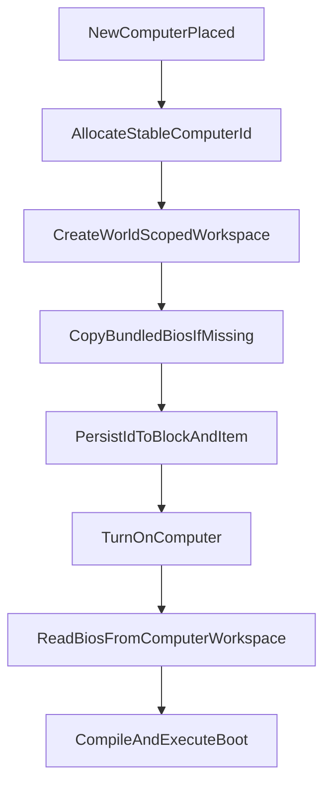

# Per-computer world-scoped VFS

## Goal

Each computer should have its own persistent workspace inside the current world save, created when the computer first gets a stable identity. That workspace should be initialized with `bios.ck.kts`, and boot should read the script from the computer's own workspace instead of the bundled `rom` resource.

## Current state

- `[/home/lazyhat/IdeaProjects/Compukter-Kraft/mod/src/main/kotlin/ru/lazyhat/compukterkraft/computer/vm/ComputerWorkspaceHost.kt](/home/lazyhat/IdeaProjects/Compukter-Kraft/mod/src/main/kotlin/ru/lazyhat/compukterkraft/computer/vm/ComputerWorkspaceHost.kt)` already gives each `computerId` its own folder, but it is global under `compukterkraft/scripts/computers/<id>` and only creates directories lazily on file access.
- `[/home/lazyhat/IdeaProjects/Compukter-Kraft/mod/src/main/kotlin/ru/lazyhat/compukterkraft/computer/ServerComputer.kt](/home/lazyhat/IdeaProjects/Compukter-Kraft/mod/src/main/kotlin/ru/lazyhat/compukterkraft/computer/ServerComputer.kt)` still boots from `environment.bundledScript(profile.bootScriptName)`, so `bios.ck.kts` is never copied into or executed from the computer's own workspace.
- `[/home/lazyhat/IdeaProjects/Compukter-Kraft/mod/src/main/kotlin/ru/lazyhat/compukterkraft/block/AbstractComputerBlockEntity.kt](/home/lazyhat/IdeaProjects/Compukter-Kraft/mod/src/main/kotlin/ru/lazyhat/compukterkraft/block/AbstractComputerBlockEntity.kt)` assigns IDs with `(0..9).random()`, which is unsafe once the workspace becomes the canonical persistent disk for each computer.

## Implementation plan

1. Introduce a world-scoped workspace root.

- Replace the fixed root from `ScriptingPaths.scriptsDirectory()/computers` with a root derived from the active server/world via `[/home/lazyhat/IdeaProjects/Compukter-Kraft/mod/src/main/kotlin/ru/lazyhat/compukterkraft/context/ServerContext.kt](/home/lazyhat/IdeaProjects/Compukter-Kraft/mod/src/main/kotlin/ru/lazyhat/compukterkraft/context/ServerContext.kt)`.
- Keep the on-disk shape simple, for example `<world>/compukterkraft/computers/<computerId>/`.
- Prefer constructing the workspace from `ServerContext.server` inside `[/home/lazyhat/IdeaProjects/Compukter-Kraft/mod/src/main/kotlin/ru/lazyhat/compukterkraft/computer/vm/ComputerVmSupervisor.kt](/home/lazyhat/IdeaProjects/Compukter-Kraft/mod/src/main/kotlin/ru/lazyhat/compukterkraft/computer/vm/ComputerVmSupervisor.kt)` instead of relying on the global `ScriptingPaths` helper.

1. Add explicit workspace initialization and BIOS seeding.

- Extend `[/home/lazyhat/IdeaProjects/Compukter-Kraft/mod/src/main/kotlin/ru/lazyhat/compukterkraft/computer/vm/ComputerWorkspaceHost.kt](/home/lazyhat/IdeaProjects/Compukter-Kraft/mod/src/main/kotlin/ru/lazyhat/compukterkraft/computer/vm/ComputerWorkspaceHost.kt)` with an `ensureInitialized(computerId)`-style entry point that:
  - creates the per-computer directory,
  - copies bundled `rom/bios.ck.kts` into `<computerRoot>/bios.ck.kts` only if it does not exist,
  - remains idempotent so existing disks are not overwritten.
- Source the seed file through the existing scripting environment so the bundled ROM remains the single source of truth.

1. Boot from the computer workspace instead of bundled ROM.

- Update `[/home/lazyhat/IdeaProjects/Compukter-Kraft/mod/src/main/kotlin/ru/lazyhat/compukterkraft/computer/ServerComputer.kt](/home/lazyhat/IdeaProjects/Compukter-Kraft/mod/src/main/kotlin/ru/lazyhat/compukterkraft/computer/ServerComputer.kt)` so `turnOn()` ensures the workspace exists, reads `bios.ck.kts` from the workspace, and compiles that file content.
- Keep the script name as `profile.bootScriptName` so existing profile-based boot configuration still works.
- Preserve the current compile/evaluate pipeline and bindings; only the script source location should change.

1. Make computer identity stable enough for per-disk persistence.

- Replace the current random `0..9` allocation in `[/home/lazyhat/IdeaProjects/Compukter-Kraft/mod/src/main/kotlin/ru/lazyhat/compukterkraft/block/AbstractComputerBlockEntity.kt](/home/lazyhat/IdeaProjects/Compukter-Kraft/mod/src/main/kotlin/ru/lazyhat/compukterkraft/block/AbstractComputerBlockEntity.kt)` with a monotonic unique allocator stored server-side, or another persistent unique-ID mechanism.
- Continue persisting `ComputerID` in block entity/item NBT so breaking and replacing a computer keeps the same disk.
- Hook workspace initialization to the point where a brand-new ID is minted, not merely when a chunk reloads an existing computer.

1. Preserve existing sandbox/runtime boundaries.

- Do not bypass the existing `HostCall.File* -> ComputerWorkspace` path used by the VM.
- Keep the current path traversal defense in workspace resolution: normalized child path must still stay under the computer root.
- Do not alter `ComputerScriptBindings`, runtime `executionProperties()`, or the scripting classloader setup in `[/home/lazyhat/IdeaProjects/Compukter-Kraft/scripting/src/main/kotlin/ru/lazyhat/compukterkraft/scripting/impl/ScriptingEnvironmentImpl.kt](/home/lazyhat/IdeaProjects/Compukter-Kraft/scripting/src/main/kotlin/ru/lazyhat/compukterkraft/scripting/impl/ScriptingEnvironmentImpl.kt)` except where needed to read/copy the bundled BIOS.

## Suggested flow

## Validation

- Update `[/home/lazyhat/IdeaProjects/Compukter-Kraft/mod/src/test/kotlin/ScriptingRuntimeTest.kt](/home/lazyhat/IdeaProjects/Compukter-Kraft/mod/src/test/kotlin/ScriptingRuntimeTest.kt)` or add a focused test to cover booting from a seeded workspace file instead of directly from `bundledScript(...)`.
- Add workspace tests for:
  - per-world root resolution,
  - idempotent BIOS seeding,
  - preserving user-modified `bios.ck.kts`,
  - rejecting `..` path escape attempts.
- If practical, add an integration test for: place computer -> create disk folder -> power on -> execute workspace BIOS.

## Important note

The current codebase does not enforce a hard JVM sandbox for Kotlin scripts; the strongest protection today is the host API surface plus workspace path containment. This refactor should preserve that boundary, not broaden direct file access.