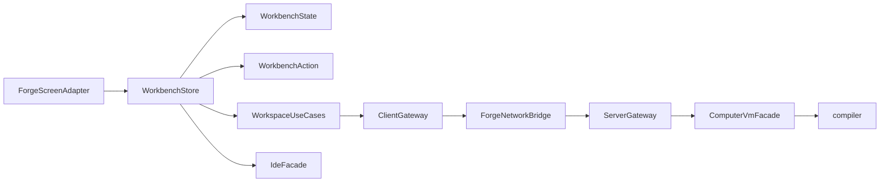

# Pure Kotlin Rewrite

## Цель

Перевести проект от текущего смешения `UI + state + networking + Forge glue` к чистой Kotlin-архитектуре с явными state-моделями, use-case слоями и тонкими адаптерами для Minecraft/Forge.

## Что уже видно в коде

- `compiler` уже изолирован как отдельный модуль, но [compiler/src/main/kotlin/ck/lang/frontend/LanguageFrontend.kt](/home/lazyhat/IdeaProjects/Compukter-Kraft/compiler/src/main/kotlin/ck/lang/frontend/LanguageFrontend.kt) разрастается в монолит, совмещая orchestration, semantic analysis и compile pipeline.
- `UI` и transport тесно связаны в [mod/src/main/kotlin/ck/mod/gui/ComputerWorkbenchPresenter.kt](/home/lazyhat/IdeaProjects/Compukter-Kraft/mod/src/main/kotlin/ck/mod/gui/ComputerWorkbenchPresenter.kt) и [mod/src/main/kotlin/ck/mod/gui/screen/ComputerWorkbenchScreen.kt](/home/lazyhat/IdeaProjects/Compukter-Kraft/mod/src/main/kotlin/ck/mod/gui/screen/ComputerWorkbenchScreen.kt): layout-магия, editor state, IDE integration и packet-вызовы живут вперемешку.
- Client-server flow завязан на menu/container и packet-классы напрямую в [mod/src/main/kotlin/ck/mod/network/server/ComputerWorkspaceServerMessage.kt](/home/lazyhat/IdeaProjects/Compukter-Kraft/mod/src/main/kotlin/ck/mod/network/server/ComputerWorkspaceServerMessage.kt), [mod/src/main/kotlin/ck/mod/platform/NetworkHandler.kt](/home/lazyhat/IdeaProjects/Compukter-Kraft/mod/src/main/kotlin/ck/mod/platform/NetworkHandler.kt) и [mod/src/main/kotlin/ck/mod/menu/AbstractComputerMenu.kt](/home/lazyhat/IdeaProjects/Compukter-Kraft/mod/src/main/kotlin/ck/mod/menu/AbstractComputerMenu.kt).
- Есть явные Java-style участки, которые стоит убрать в ходе переписи, например [mod/src/main/kotlin/ck/mod/platform/Services.kt](/home/lazyhat/IdeaProjects/Compukter-Kraft/mod/src/main/kotlin/ck/mod/platform/Services.kt).

## Целевая архитектура

## План работ

### 1. Разрезать проект на чистые слои

- Оставить `compiler` чистым Kotlin-модулем для lexer/parser/analyzer/IDE/runtime abstractions.
- Внутри `mod` выделить пакеты уровня `domain`, `application`, `infrastructure`, `ui` вместо текущего горизонтального смешения `gui`, `network`, `menu`, `platform`.
- Сделать Forge/Minecraft API тонким outer layer: screen, menu, packet registration, block entity hooks должны только адаптировать вызовы в pure Kotlin сервисы.

### 2. Переписать editor/workbench UI на state-driven модель

- Заменить текущую связку screen/presenter на `WorkbenchStore` + immutable `WorkbenchState` + sealed `WorkbenchAction`/`WorkbenchEvent`.
- Вынести layout-геометрию в единый `WorkbenchLayoutModel`, чтобы hit-testing, rendering и input использовали одну модель координат вместо дублирования магических чисел.
- Вынести editor operations в отдельный pure Kotlin слой: cursor movement, selection, scrolling, completion, hover, document dirty-state.

### 3. Перестроить client-server flow

- Убрать прямую зависимость UI от packet-классов: вместо `ClientNetworking.sendToServer(...)` в UI ввести gateway/use-case интерфейсы.
- Заменить packet-centric подход на feature-centric contracts: `WorkspaceGateway`, `TerminalGateway`, `ComputerControlGateway`.
- Нормализовать маршрутизацию по `computerId/sessionId/containerId`, чтобы состояние не зависело от случайного `player.containerMenu` и не требовало polling из UI.
- Перевести обновления workspace/document/terminal на event-driven синхронизацию с явными state snapshots/deltas.

### 4. Декомпозировать language stack

- Разделить [compiler/src/main/kotlin/ck/lang/frontend/LanguageFrontend.kt](/home/lazyhat/IdeaProjects/Compukter-Kraft/compiler/src/main/kotlin/ck/lang/frontend/LanguageFrontend.kt) на отдельные компоненты: parse pipeline, semantic analyzer, symbol/reference services, compile pipeline.
- Ввести маленькие facade-интерфейсы: `ParserFacade`, `AnalyzerFacade`, `CompilerFacade`, `IdeFacade`.
- Убрать повторный semantic pass там, где можно переиспользовать единый `AnalysisResult` и derive-компоненты поверх него.

### 5. Почистить Kotlin style и общие утилиты

- Удалить Java-style service/singleton/helper паттерны там, где Kotlin `object`, `lazy`, top-level functions и sealed models дают более простой код.
- Свести повторяющийся formatter/layout/helper код в маленькие pure functions вместо дублирования между client/server реализациями.
- Пересмотреть имена и файловую структуру, чтобы code navigation отражал feature boundaries, а не технические случайности.

### 6. Сделать миграцию безопасной

- Идти вертикальными срезами: сначала новый workbench flow, затем network bridge, затем compiler decomposition, затем cleanup legacy слоёв.
- На переходный период держать адаптеры между старым menu/packet API и новым application слоем, чтобы не ломать всё одновременно.
- После каждого среза прогонять существующие тесты и добавлять только те новые тесты, которые фиксируют state reducers, workspace use-cases и compiler seams.

## Ключевые файлы первой волны

- [mod/src/main/kotlin/ck/mod/gui/ComputerWorkbenchPresenter.kt](/home/lazyhat/IdeaProjects/Compukter-Kraft/mod/src/main/kotlin/ck/mod/gui/ComputerWorkbenchPresenter.kt)
- [mod/src/main/kotlin/ck/mod/gui/screen/ComputerWorkbenchScreen.kt](/home/lazyhat/IdeaProjects/Compukter-Kraft/mod/src/main/kotlin/ck/mod/gui/screen/ComputerWorkbenchScreen.kt)
- [mod/src/main/kotlin/ck/mod/menu/AbstractComputerMenu.kt](/home/lazyhat/IdeaProjects/Compukter-Kraft/mod/src/main/kotlin/ck/mod/menu/AbstractComputerMenu.kt)
- [mod/src/main/kotlin/ck/mod/network/server/ComputerWorkspaceServerMessage.kt](/home/lazyhat/IdeaProjects/Compukter-Kraft/mod/src/main/kotlin/ck/mod/network/server/ComputerWorkspaceServerMessage.kt)
- [mod/src/main/kotlin/ck/mod/platform/NetworkHandler.kt](/home/lazyhat/IdeaProjects/Compukter-Kraft/mod/src/main/kotlin/ck/mod/platform/NetworkHandler.kt)
- [mod/src/main/kotlin/ck/mod/language/LanguageServices.kt](/home/lazyhat/IdeaProjects/Compukter-Kraft/mod/src/main/kotlin/ck/mod/language/LanguageServices.kt)
- [compiler/src/main/kotlin/ck/lang/frontend/LanguageFrontend.kt](/home/lazyhat/IdeaProjects/Compukter-Kraft/compiler/src/main/kotlin/ck/lang/frontend/LanguageFrontend.kt)
- [compiler/src/main/kotlin/ck/lang/frontend/LanguageIde.kt](/home/lazyhat/IdeaProjects/Compukter-Kraft/compiler/src/main/kotlin/ck/lang/frontend/LanguageIde.kt)

## Ожидаемый результат

- UI станет декларативнее и проще для чтения.
- Client/server слой перестанет протекать в экран и presenter.
- `compiler` станет модульнее и удобнее для эволюции IDE/runtime фич.
- Кодовая база уйдёт от Java-style шаблонов к небольшим Kotlin-first abstractions.

