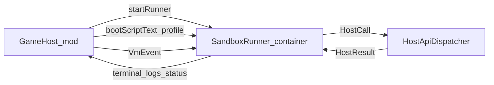

# План внедрения sandbox runner

## Цель

Перенести компиляцию, `execute(...)` boot-скрипта и дальнейшее выполнение `ComputerProgram.run(runtime)` из процесса сервера в отдельный sandboxed runner. Хост должен предоставлять только ограниченный API через IPC; прямого доступа к JVM/FS/host process у скрипта быть не должно.

## Текущие точки интеграции

- Хост сейчас загружает scripting runtime через `[mod/src/main/kotlin/ru/lazyhat/compukterkraft/scripting/runtime/ScriptingJarLoader.kt](mod/src/main/kotlin/ru/lazyhat/compukterkraft/scripting/runtime/ScriptingJarLoader.kt)` и кладёт реализацию в `[mod/src/main/kotlin/ru/lazyhat/compukterkraft/scripting/runtime/ScriptingEnvironmentHolder.kt](mod/src/main/kotlin/ru/lazyhat/compukterkraft/scripting/runtime/ScriptingEnvironmentHolder.kt)`.
- Boot flow локально компилирует и исполняет скрипт в `[mod/src/main/kotlin/ru/lazyhat/compukterkraft/computer/ServerComputer.kt](mod/src/main/kotlin/ru/lazyhat/compukterkraft/computer/ServerComputer.kt)`.
- Capability API уже оформлен в `[scripting-api/src/main/kotlin/ru/lazyhat/compukterkraft/machine/ComputerRuntime.kt](scripting-api/src/main/kotlin/ru/lazyhat/compukterkraft/machine/ComputerRuntime.kt)`.
- Логическая граница host/guest уже почти есть в `[mod/src/main/kotlin/ru/lazyhat/compukterkraft/computer/vm/BackgroundComputerVm.kt](mod/src/main/kotlin/ru/lazyhat/compukterkraft/computer/vm/BackgroundComputerVm.kt)` и `[scripting-api/src/main/kotlin/ru/lazyhat/compukterkraft/machine/ComputerVmModels.kt](scripting-api/src/main/kotlin/ru/lazyhat/compukterkraft/machine/ComputerVmModels.kt)` через `HostCall` / `HostResult`.

## Архитектурное решение

- Добавить новый модуль `scripting-runner` с `main()` для long-lived worker.
- Оставить `scripting` как движок компиляции/выполнения, но использовать его только внутри runner.
- Вынести transport DTO в `scripting-api` или новый `scripting-protocol` модуль, если не хочется смешивать transport и доменные модели.
- Реализовать `RemoteComputerRuntime` внутри runner: все `filesystem/system/terminal/...` ходят к хосту только через IPC.
- На стороне `mod` заменить локальный `BackgroundComputerVm` backend на IPC-backed backend или ввести новый `RemoteComputerVmHandle`, сохранив внешнюю семантику `start/requestSlice/drainHostCalls/deliverHostResults`.

## Этапы реализации

### 1. Ввести протокол между хостом и runner

Добавить сериализуемые сообщения:

- `BootRequest`, `BootResponse`
- `RunnerCommand` / `RunnerEvent`
- `HostCallMessage`, `HostResultMessage`
- `RunnerStatus`, `RunnerFailure`

Файлы для опоры:

- `[scripting-api/src/main/kotlin/ru/lazyhat/compukterkraft/machine/ComputerRuntime.kt](scripting-api/src/main/kotlin/ru/lazyhat/compukterkraft/machine/ComputerRuntime.kt)`
- `[scripting-api/src/main/kotlin/ru/lazyhat/compukterkraft/machine/ComputerVmModels.kt](scripting-api/src/main/kotlin/ru/lazyhat/compukterkraft/machine/ComputerVmModels.kt)`

Решение:

- Максимально переиспользовать существующие `HostCall` / `HostResult` как форму IPC, чтобы не изобретать новую доменную модель.
- Сериализацию сделать явной и стабильной: `kotlinx.serialization` + length-prefixed JSON/CBOR по `stdin/stdout`.

### 2. Собрать отдельный `scripting-runner`

Создать новый модуль с зависимостями на `scripting`, `scripting-api` и transport-модели.

В runner:

- принимать `BootRequest`
- компилировать boot script через существующий `[scripting/src/main/kotlin/ru/lazyhat/compukterkraft/scripting/impl/ScriptCompilerImpl.kt](scripting/src/main/kotlin/ru/lazyhat/compukterkraft/scripting/impl/ScriptCompilerImpl.kt)`
- исполнять `execute(...)` и запускать `ComputerProgram.run(runtime)` уже внутри runner
- держать event loop и ожидать события/ответы хоста

Ключевой принцип:

- `ComputerProgram` никогда не пересекает IPC-границу как объект.

### 3. Реализовать прокси runtime внутри runner

В runner сделать `RemoteComputerRuntime`, реализующий `ComputerRuntime`.

Каждый capability-метод:

- не работает локально с хостом
- формирует `HostCallMessage`
- ждёт `HostResultMessage`

Особенно важно:

- `filesystem` в runner не имеет доступа к хостовому FS вообще
- файловые операции возможны только через `ComputerFileSystemApi`
- `pullEvent`, `sleep`, `yield` синхронизировать с существующей моделью событий/тик-слайсов

### 4. Добавить host-side transport manager

На стороне `mod` добавить менеджер процесса runner:

- запуск/остановка
- healthcheck
- таймауты
- разбор stdout/stderr
- kill hung runner

Точки интеграции:

- `[mod/src/main/kotlin/ru/lazyhat/compukterkraft/scripting/runtime/ScriptingJarLoader.kt](mod/src/main/kotlin/ru/lazyhat/compukterkraft/scripting/runtime/ScriptingJarLoader.kt)`
- `[mod/src/main/kotlin/ru/lazyhat/compukterkraft/scripting/runtime/ScriptingEnvironmentHolder.kt](mod/src/main/kotlin/ru/lazyhat/compukterkraft/scripting/runtime/ScriptingEnvironmentHolder.kt)`

Решение:

- либо заменить `ScriptingJarLoader` на launcher/process manager,
- либо оставить его только для IDE/local fallback, а для исполнения завести отдельный `SandboxRunnerLauncher`.

### 5. Перевести boot flow на удалённое исполнение

В `[mod/src/main/kotlin/ru/lazyhat/compukterkraft/computer/ServerComputer.kt](mod/src/main/kotlin/ru/lazyhat/compukterkraft/computer/ServerComputer.kt)`:

- убрать локальный `compile(...).execute(handle.executionProperties())`
- вместо этого отправлять boot script текст и профиль в runner
- получать статус запуска и дальше общаться с runner как с активной VM-сессией

Цель:

- сервер больше не исполняет пользовательский Kotlin-код у себя в JVM.

### 6. Сохранить текущую host call модель, но заменить backend

Вместо прямого in-process `BackgroundComputerVm`:

- либо адаптировать его в IPC transport loop,
- либо ввести отдельный `RemoteComputerVmHandle` с тем же контрактом, чтобы `ServerComputer` почти не менялся.

Опорные файлы:

- `[mod/src/main/kotlin/ru/lazyhat/compukterkraft/computer/vm/BackgroundComputerVm.kt](mod/src/main/kotlin/ru/lazyhat/compukterkraft/computer/vm/BackgroundComputerVm.kt)`
- `[mod/src/main/kotlin/ru/lazyhat/compukterkraft/computer/vm/ComputerVmSupervisor.kt](mod/src/main/kotlin/ru/lazyhat/compukterkraft/computer/vm/ComputerVmSupervisor.kt)`

Предпочтение:

- новый `RemoteComputerVmHandle`, чтобы не ломать локальную coroutine-модель до полного перехода.

### 7. Упаковать runner в Linux sandbox

Добавить Docker/Podman образ или аналогичный rootless container runtime pipeline.

Требования контейнера:

- `--network=none`
- `--read-only`
- `--cap-drop=ALL`
- non-root user
- `--pids-limit`
- memory/cpu limits
- `--security-opt=no-new-privileges`
- seccomp/AppArmor профиль
- только `tmpfs` для временных директорий
- без bind mount к workspace/world/config

Принцип:

- доступ к хосту только через IPC, не через mounts.

### 8. Добавить отказоустойчивость и политику безопасности

- таймаут компиляции boot script
- таймаут ответа на host call
- лимит размера stdout/log payload
- лимит числа pending host calls
- детерминированное завершение session при crash runner
- явные ошибки в терминал компьютера вместо silent failure

### 9. Довести IDE/analysis до той же границы доверия

Сейчас IDE/diagnostics завязаны на `ScriptingEnvironment` и потенциально компилятор в том же процессе.

Если нужна полная граница доверия:

- анализ/hover/completion тоже гонять через runner или отдельный analysis-runner
- минимум: не исполнять user script для IDE в процессе игры

## Порядок доставки

- Сначала минимально рабочий `runner` как отдельный процесс с IPC, без контейнеризации, но уже без передачи живых хостовых объектов.
- Затем упаковать тот же runner в rootless container.
- Затем усилить hardening и таймауты.
- После стабилизации перевести IDE/analysis в ту же модель.

## Риски и проверки

- Главный риск: текущая модель ожидает вернуть `ComputerProgram` как локальный JVM-объект; это нужно убрать как часть границы доверия.
- Главный инвариант: ни один объект хоста (`ComputerRuntime`, `File`, `Path`, `Logger`, world access) не должен попадать в runner иначе как через сериализованное сообщение.
- Тесты понадобятся на:
  - запуск boot script через IPC
  - host call roundtrip
  - path traversal только через filesystem API
  - crash/timeout runner
  - отказ при попытке доступа к сети/хостовому FS внутри контейнера

