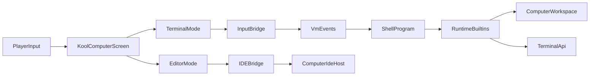

# План shell и Kool IDE

## Рекомендуемая архитектура

Сделать один Kool-based экран компьютера с двумя режимами:

- `terminal mode` по умолчанию: весь экран отдан терминалу, без элементов IDE
- `editor mode`: файловое дерево, редактор, diagnostics/completion/hover/definition

Так вы не дублируете ввод, терминальную модель и сетевую синхронизацию, а просто меняете layout и набор активных панелей. Shell при этом должен быть обычной программой на вашем ЯП, а не host-компонентом.

## Что уже можно переиспользовать

- Runtime API уже задаёт terminal/filesystem/events в `[/home/lazyhat/IdeaProjects/Compukter-Kraft/compiler/src/main/kotlin/ck/lang/runtime/ComputerRuntime.kt](/home/lazyhat/IdeaProjects/Compukter-Kraft/compiler/src/main/kotlin/ck/lang/runtime/ComputerRuntime.kt)`.
- Builtins языка уже экспортируют `terminal`, `filesystem`, `system`, `events`, но shell-команд для `list/mkdir/rmdir/cd` пока нет в `[/home/lazyhat/IdeaProjects/Compukter-Kraft/compiler/src/main/kotlin/ck/lang/frontend/LanguageBuiltins.kt](/home/lazyhat/IdeaProjects/Compukter-Kraft/compiler/src/main/kotlin/ck/lang/frontend/LanguageBuiltins.kt)`.
- Компьютер уже компилирует и запускает `bios.ck` через VM в `[/home/lazyhat/IdeaProjects/Compukter-Kraft/mod/src/main/kotlin/ck/mod/computer/ServerComputer.kt](/home/lazyhat/IdeaProjects/Compukter-Kraft/mod/src/main/kotlin/ck/mod/computer/ServerComputer.kt)`.
- Workspace и IDE host уже есть в `[/home/lazyhat/IdeaProjects/Compukter-Kraft/mod/src/main/kotlin/ck/mod/computer/vm/ComputerWorkspaceHost.kt](/home/lazyhat/IdeaProjects/Compukter-Kraft/mod/src/main/kotlin/ck/mod/computer/vm/ComputerWorkspaceHost.kt)`.
- Kool пока только подключён как зависимость и имеет пустую точку входа в `[/home/lazyhat/IdeaProjects/Compukter-Kraft/mod/src/main/kotlin/ck/mod/gui/KoolScreen.kt](/home/lazyhat/IdeaProjects/Compukter-Kraft/mod/src/main/kotlin/ck/mod/gui/KoolScreen.kt)`, а текущий терминальный GUI живёт в `[/home/lazyhat/IdeaProjects/Compukter-Kraft/mod/src/main/kotlin/ck/mod/gui/ComputerScreen.kt](/home/lazyhat/IdeaProjects/Compukter-Kraft/mod/src/main/kotlin/ck/mod/gui/ComputerScreen.kt)`.

## Этапы

### 1. Расширить runtime до модели shell

Сначала закрыть минимальные системные примитивы, чтобы shell можно было написать на вашем ЯП, а не на Kotlin.

Сделать:

- добавить в `filesystem` builtins минимум `list`, `makeDir`, `remove`, `isDirectory` или эквивалентный набор
- добавить терминальный ввод как отдельный слой, а не пытаться эмулировать `stdin` только через raw events
- определить контракт shell I/O: строковый ввод команды, stdout/stderr-каналы, код завершения процесса/команды
- решить модель текущего каталога: в shell state, а не в глобальном runtime

Ключевые точки:

- `[/home/lazyhat/IdeaProjects/Compukter-Kraft/compiler/src/main/kotlin/ck/lang/runtime/ComputerRuntime.kt](/home/lazyhat/IdeaProjects/Compukter-Kraft/compiler/src/main/kotlin/ck/lang/runtime/ComputerRuntime.kt)`
- `[/home/lazyhat/IdeaProjects/Compukter-Kraft/compiler/src/main/kotlin/ck/lang/frontend/LanguageBuiltins.kt](/home/lazyhat/IdeaProjects/Compukter-Kraft/compiler/src/main/kotlin/ck/lang/frontend/LanguageBuiltins.kt)`
- `[/home/lazyhat/IdeaProjects/Compukter-Kraft/mod/src/main/kotlin/ck/mod/computer/ServerComputer.kt](/home/lazyhat/IdeaProjects/Compukter-Kraft/mod/src/main/kotlin/ck/mod/computer/ServerComputer.kt)`

### 2. Ввести процессную модель поверх VM

Текущий компьютер грузит один `bios.ck`. Для shell и мини-программ нужен рантайм запуска программ по пути, хотя бы последовательно.

Сделать:

- определить, что такое `program`: файл workspace с entrypoint
- реализовать shell launcher: `shell -> load/compile/run target program`
- решить политику компиляции: compile-on-run с кэшем по версии файла
- определить минимальный ABI для программ: аргументы, вывод, exit status

Практичный MVP:

- сначала один активный дочерний процесс поверх shell без настоящего multitasking
- затем при необходимости фоновые задачи

### 3. Написать системные программы на вашем ЯП

Сделать shell как набор скриптов/модулей в ROM/workspace:

- `bios.ck` грузит shell
- `shell.ck` реализует prompt, парсинг командной строки, dispatch
- базовые программы: `ls`, `cd`, `mkdir`, `rmdir`, `cat`, `edit` или их встроенные аналоги

Важно:

- `cd` почти наверняка должна быть builtin-командой shell, а не отдельной программой, потому что меняет shell state
- `ls/mkdir/rmdir/cat` можно делать отдельными программами
- shell должен уметь падать в raw terminal mode для полноэкранных приложений позже

### 4. Отвязать GUI от старого Minecraft terminal screen и перенести его на Kool

Не переносить сразу IDE-всё-сразу. Сначала добиться полного parity терминального режима.

Сделать:

- спроектировать новый `KoolComputerScreen` как замену текущему `ComputerScreen`
- перенести рендер terminal buffer, курсора, скролла, выделения, resize policy и input routing
- сохранить совместимость с текущей terminal/network model, чтобы серверная часть почти не менялась
- оставить `ServerComputer` и `NetworkedTerminal` источником состояния, а Kool сделать клиентским представлением

Ключевые точки:

- `[/home/lazyhat/IdeaProjects/Compukter-Kraft/mod/src/main/kotlin/ck/mod/gui/KoolScreen.kt](/home/lazyhat/IdeaProjects/Compukter-Kraft/mod/src/main/kotlin/ck/mod/gui/KoolScreen.kt)`
- `[/home/lazyhat/IdeaProjects/Compukter-Kraft/mod/src/main/kotlin/ck/mod/gui/ComputerScreen.kt](/home/lazyhat/IdeaProjects/Compukter-Kraft/mod/src/main/kotlin/ck/mod/gui/ComputerScreen.kt)`
- `[/home/lazyhat/IdeaProjects/Compukter-Kraft/mod/src/main/kotlin/ck/mod/ClientRegistry.kt](/home/lazyhat/IdeaProjects/Compukter-Kraft/mod/src/main/kotlin/ck/mod/ClientRegistry.kt)`

### 5. Добавить IDE-режим на том же Kool-экране

После terminal parity включить второй режим UI, не ломая обычный терминал.

Сделать:

- layout с editor pane, file tree, diagnostics panel, status bar
- открыть файл из workspace и сохранять его обратно через `ComputerWorkspace`
- подключить `snapshot`, `complete`, `hover`, `definition` из `ComputerIdeHost`
- визуализировать syntax highlight по `HighlightToken`, ошибки по `Diagnostic`
- сделать явное переключение режимов: hotkey, кнопка, command palette или системная команда shell

Ключевые точки:

- `[/home/lazyhat/IdeaProjects/Compukter-Kraft/compiler/src/main/kotlin/ck/lang/runtime/ComputerWorkspace.kt](/home/lazyhat/IdeaProjects/Compukter-Kraft/compiler/src/main/kotlin/ck/lang/runtime/ComputerWorkspace.kt)`
- `[/home/lazyhat/IdeaProjects/Compukter-Kraft/compiler/src/main/kotlin/ck/lang/frontend/LanguageIde.kt](/home/lazyhat/IdeaProjects/Compukter-Kraft/compiler/src/main/kotlin/ck/lang/frontend/LanguageIde.kt)`
- `[/home/lazyhat/IdeaProjects/Compukter-Kraft/mod/src/main/kotlin/ck/mod/computer/vm/ComputerWorkspaceHost.kt](/home/lazyhat/IdeaProjects/Compukter-Kraft/mod/src/main/kotlin/ck/mod/computer/vm/ComputerWorkspaceHost.kt)`

### 6. Свести shell и IDE в единый UX

Финальный шаг: сделать так, чтобы IDE и shell были частями одной компьютерной среды.

Сделать:

- запуск файла из IDE в active computer session
- возможность открыть файл из shell в IDE-режиме
- diagnostics после сохранения и compile/run feedback в терминал или output panel
- системные сценарии: новый файл, открыть ROM-программу, перезапуск shell, recovery после compile error

## MVP

Считать первую поставку успешной, когда:

- `bios.ck` загружает shell на вашем ЯП
- shell принимает команду строкой и печатает результат в терминал
- работают `cd`, `ls`, `mkdir`, `rmdir` и запуск простой пользовательской программы
- новый Kool GUI умеет полноценно работать в terminal mode
- в editor mode можно открыть `.ck` файл, редактировать, сохранить и увидеть diagnostics/highlighting/completion

## Риски и порядок внедрения

Рекомендуемый порядок доставки:

1. runtime/builtins для shell
2. shell + системные программы
3. Kool terminal-only screen
4. Kool editor mode
5. связка run-from-editor

Главные риски:

- если пытаться делать shell и IDE одновременно, легко смешать системный runtime, UX и редакторный стек
- если `stdin` не будет оформлен как отдельная абстракция, shell быстро упрётся в raw `key/char/paste` events
- если новый Kool GUI сразу завязать на IDE-виджеты, можно надолго потерять простой fullscreen terminal mode

