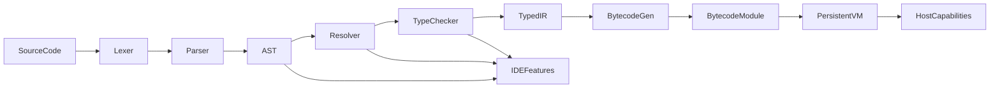

# План собственного языка и VM

## Цель

Заменить Kotlin Scripting на собственный статически типизированный язык, который исполняется в контролируемой VM, поддерживает persistent state между тиками, расширяется через capability-based API и даёт базу для IDE: диагностики, подсветки, completion, hover и перехода к определению.

## Ключевое архитектурное решение

Строить не «тонкий DSL поверх JVM», а полноценный минимальный language stack:

- frontend языка: lexer, parser, AST, resolver, type checker
- backend: lowering в собственный bytecode
- runtime: собственная persistent VM
- host boundary: только typed host calls/capabilities
- IDE: поверх того же frontend, без отдельной логики парсинга/типов

## Что оставить из текущего проекта

- Сохранить capability-модель из `[scripting-api/src/main/kotlin/ru/lazyhat/compukterkraft/machine/ComputerRuntime.kt](scripting-api/src/main/kotlin/ru/lazyhat/compukterkraft/machine/ComputerRuntime.kt)` как основу host API.
- Переиспользовать доменные модели VM и хостовых вызовов из `[scripting-api/src/main/kotlin/ru/lazyhat/compukterkraft/machine/ComputerVmModels.kt](scripting-api/src/main/kotlin/ru/lazyhat/compukterkraft/machine/ComputerVmModels.kt)`, но отвязать их от `ComputerProgram` как JVM-объекта.
- Сохранить workspace/IDE integration точки в `[mod/src/main/kotlin/ru/lazyhat/compukterkraft/computer/vm/ComputerWorkspaceHost.kt](mod/src/main/kotlin/ru/lazyhat/compukterkraft/computer/vm/ComputerWorkspaceHost.kt)` и `[mod/src/main/kotlin/ru/lazyhat/compukterkraft/computer/ServerComputer.kt](mod/src/main/kotlin/ru/lazyhat/compukterkraft/computer/ServerComputer.kt)`, но заменить scripting backend.

## Целевая модель языка v1

Делать язык уровня mini-Kotlin / mini-TypeScript, но не пытаться сразу повторить Kotlin.

Поддержать в v1:

- top-level `fun`
- `val`и `var`
- `if`, `while`, `return`
- литералы: `Int`, `Long`, `Bool`, `String`, `Unit`
- простые `struct`/`record`
- typed function calls
- `import` builtin-модулей
- entrypoint программы (`main` или модульный boot entry)
- явные host intrinsics: `sleep`, `yield`, `pullEvent`, filesystem/system/terminal calls

Не включать в v1:

- generics
- inheritance/classes с метод-резолвингом
- reflection
- exceptions
- operator overloading
- user-defined macros
- перегрузку функций по сложным правилам

## Предлагаемая структура модулей

Добавить новые модули рядом с текущими `scripting*`:

- `lang-api`
  - общие модели токенов, spans, diagnostics, symbols, typed signatures, bytecode metadata
- `lang-frontend`
  - lexer, parser, AST, resolver, type checker, IDE semantic model
- `lang-runtime`
  - bytecode format, VM, scheduler, persistent stack/heap/call frames, host-call bridge
- `lang-stdlib`
  - builtin modules и их typed signaturesfb
- `mod`
  - адаптер host capabilities и интеграция новой VM

Если хочешь сократить число модулей на старте, можно начать с трёх:

- `lang-api`
- `lang-frontend`
- `lang-runtime`

## Этапы реализации

### 1. Зафиксировать язык v1 и его грамматику

Сначала описать небольшой, жёстко ограниченный язык.

Нужно сделать:

- токены и грамматику
- правила модулей и импортов
- модель типов
- правила имён и областей видимости
- ограничения v1, чтобы не расползлась сложность

Артефакты:

- `LANGUAGE.md` с синтаксисом
- примеры программ `bios`, `shell`, `hello world`
- таблица builtin modules и функций

### 2. Построить frontend компилятора

Реализовать pipeline:

- lexer -> tokens
- parser -> AST
- resolver -> symbol table
- type checker -> typed AST / HIR
- diagnostics с позициями и диапазонами

Цель:

- одна и та же семантическая модель используется и компилятором, и IDE.

Минимальные IDE-фичи, которые нужно проектировать сразу:

- syntax errors
- semantic errors
- document symbols
- goto definition
- hover по символу
- completion по локальным именам и builtin API

### 3. Спроектировать промежуточное представление

Не компилировать AST напрямую в runtime-вызовы. Ввести typed IR или HIR.

Зачем:

- проще типчекать и оптимизировать lowering
- проще отделить frontend от VM
- проще тестировать компилятор по стадиям

Минимум:

- typed expressions
- typed statements
- function bodies в нормализованной форме
- ссылки на resolved symbols вместо строковых имён

### 4. Сделать bytecode и собственную VM

Реализовать собственный формат байткода и интерпретатор.

VM должна поддерживать:

- stack frames
- local variables
- function calls
- простые структурные типы / runtime objects
- instruction budget на тик
- переходы в состояние `WAITING_EVENT`, `SLEEPING`, `RUNNING`
- сериализацию состояния между тиками

Опора на текущие модели:

- использовать состояния/снимки из `[scripting-api/src/main/kotlin/ru/lazyhat/compukterkraft/machine/ComputerVmModels.kt](scripting-api/src/main/kotlin/ru/lazyhat/compukterkraft/machine/ComputerVmModels.kt)` как базу для новой VM-модели.

### 5. Встроить capability-based host calls

Вместо передачи JVM-объектов скрипту язык должен знать только встроенные capability modules.

Например:

- `system.log(message: String): Unit`
- `filesystem.readText(path: String): String?`
- `filesystem.writeText(path: String, text: String): Unit`
- `terminal.write(text: String): Unit`
- `events.pull(filter: String?): Event`

Реализация:

- frontend знает сигнатуры этих функций через registry
- VM исполняет их как специальные инструкции или builtin function ids
- `mod` реализует фактический side effect

### 6. Заменить текущий JVM boot flow

Сейчас `ServerComputer` ожидает локальную компиляцию и возврат `ComputerProgram` из Kotlin script.

Нужно заменить это на:

- загрузку исходника нового языка из workspace
- компиляцию в bytecode module
- создание VM instance
- запуск VM через scheduler
- все pause/resume события вести через новую VM

Точки встраивания:

- `[mod/src/main/kotlin/ru/lazyhat/compukterkraft/computer/ServerComputer.kt](mod/src/main/kotlin/ru/lazyhat/compukterkraft/computer/ServerComputer.kt)`
- `[mod/src/main/kotlin/ru/lazyhat/compukterkraft/computer/vm/ComputerVmSupervisor.kt](mod/src/main/kotlin/ru/lazyhat/compukterkraft/computer/vm/ComputerVmSupervisor.kt)`
- `[mod/src/main/kotlin/ru/lazyhat/compukterkraft/computer/vm/BackgroundComputerVm.kt](mod/src/main/kotlin/ru/lazyhat/compukterkraft/computer/vm/BackgroundComputerVm.kt)`

### 7. Построить IDE на том же frontend

На базе frontend добавить сервисы вместо текущей связки Kotlin scripting IDE.

Фичи v1:

- parse/analyze document
- diagnostics
- syntax highlighting tokens
- hover
- completion
- definition lookup

Точки замены:

- `[scripting/src/main/kotlin/ru/lazyhat/compukterkraft/scripting/impl/ScriptIdeServiceImpl.kt](scripting/src/main/kotlin/ru/lazyhat/compukterkraft/scripting/impl/ScriptIdeServiceImpl.kt)`
- `[mod/src/main/kotlin/ru/lazyhat/compukterkraft/computer/vm/ComputerWorkspaceHost.kt](mod/src/main/kotlin/ru/lazyhat/compukterkraft/computer/vm/ComputerWorkspaceHost.kt)`

### 8. Продумать расширяемость языка

Расширять язык не через открытие JVM, а через registries:

- builtin type registry
- builtin module registry
- intrinsic function registry
- optional native host object descriptors

Это позволит добавлять:

- `redstone`
- `peripherals`
- сетевые/модовые capability APIs
- новые stdlib-модули

Без изменения core grammar каждый раз.

### 9. Покрыть тестами по слоям

Нужны разные уровни тестов:

- lexer/parser golden tests
- resolver/type checker tests
- bytecode generation tests
- VM execution tests
- persistence/suspend-resume tests
- host call tests
- IDE symbol/hover/completion tests

## Рекомендуемый порядок доставки

### Фаза 1. Language spec + frontend skeleton

Сначала зафиксировать язык и сделать lexer/parser/AST/diagnostics.

Результат:

- можно читать код, подсвечивать синтаксис и показывать parse errors.

### Фаза 2. Resolver + type checker

Добавить символы, области видимости и статическую типизацию.

Результат:

- появится настоящий анализатор для IDE и компилятора.

### Фаза 3. Bytecode + VM MVP

Реализовать небольшой исполнимый поднабор языка и host intrinsics.

Результат:

- можно запустить простую программу без JVM scripting.

### Фаза 4. Persistent execution model

Добавить suspend/yield/sleep/pullEvent и сериализацию VM state.

Результат:

- новая VM заменяет текущий scripting runtime для игровых компьютеров.

### Фаза 5. IDE feature parity

Довести completion/hover/definition/highlighting до уровня текущего редактора.

## Что считать MVP

MVP готов, когда:

- можно написать boot script на новом языке
- компилятор даёт статические ошибки
- программа компилируется в bytecode
- VM выполняет её по тикам
- `filesystem`, `terminal`, `system`, `events` работают через typed capabilities
- IDE показывает diagnostics и базовый completion

## Главные риски

- Самый большой риск не runtime, а расползание сложности языка. Нужно очень жёстко держать маленький v1.
- Если слишком рано добавить generics, ООП и сложный inference, сроки резко взорвутся.
- Persistent VM надо проектировать с самого начала, иначе потом будет дорого переделывать bytecode и call frames.
- IDE нельзя проектировать отдельно от frontend компилятора; иначе получится две разные системы понимания языка.

