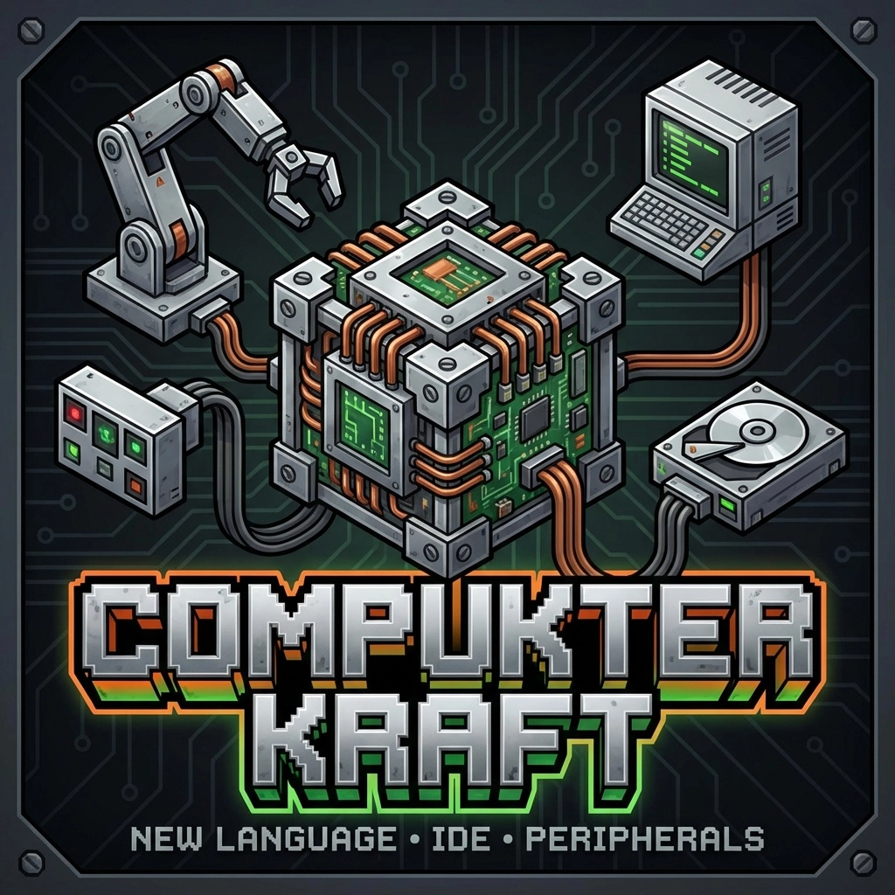

**Programmable computers for Minecraft — but with a real, statically-typed
language and a real IDE, right inside the game.**

Inspired by ComputerCraft. With one big difference: the language is not Lua.

## What you get

- 🖥 **Advanced Computer** — a block running its own VM on a background thread.
- 📟 **Portable Terminal** — bind it to any computer and carry your shell around.
- 🛠 **Workbench** — an in-game IDE with multi-file editing, syntax highlighting,
  autocomplete and live error reporting.
- 🧠 **CKL — Compukter Kraft Language** — a small, statically typed,
  Kotlin-flavoured scripting language. Compiles to bytecode, runs on a sandboxed
  VM. No reflection, no arbitrary host interop, no surprises.
- 💾 **Per-computer file system** — each computer has its own workspace on disk,
  edits survive reboots.
- 👥 **Multiplayer-friendly editor** — CRDT-based sync, two players can edit the
  same file at the same time without stepping on each other's text.

## A taste of CKL

    import terminal
    import system

    fun greet(name: String): String {
        return "Hello, " + name + "!"
    }

    fun main() {
        terminal.printLine(greet("world"))
        terminal.printLine("Computer #" + system.computerId())
    }

Types are checked at compile time. Errors show up in the editor before you ever
press Run. Because debugging Lua at 2 AM is a war crime.

## Built-in modules

`terminal`, `filesystem`, `system`, `events`, `process`, `strings` — enough to
write shells, file utilities, automation scripts, and small games.

## Status

Early access. Working: language, VM, file system, advanced computer block,
portable terminal, workbench IDE, multiplayer editor sync.
Planned: more peripherals, networking between computers, compatibility for Create.

Currently for **NeoForge 1.21.1**.

---

Devlog(in russian): https://t.me/lazyhatdev
Source: https://github.com/LazyHat/Compukter-Kraft
License: GPL-3.0